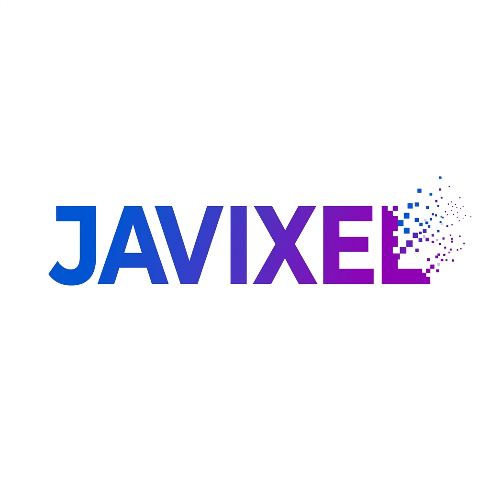
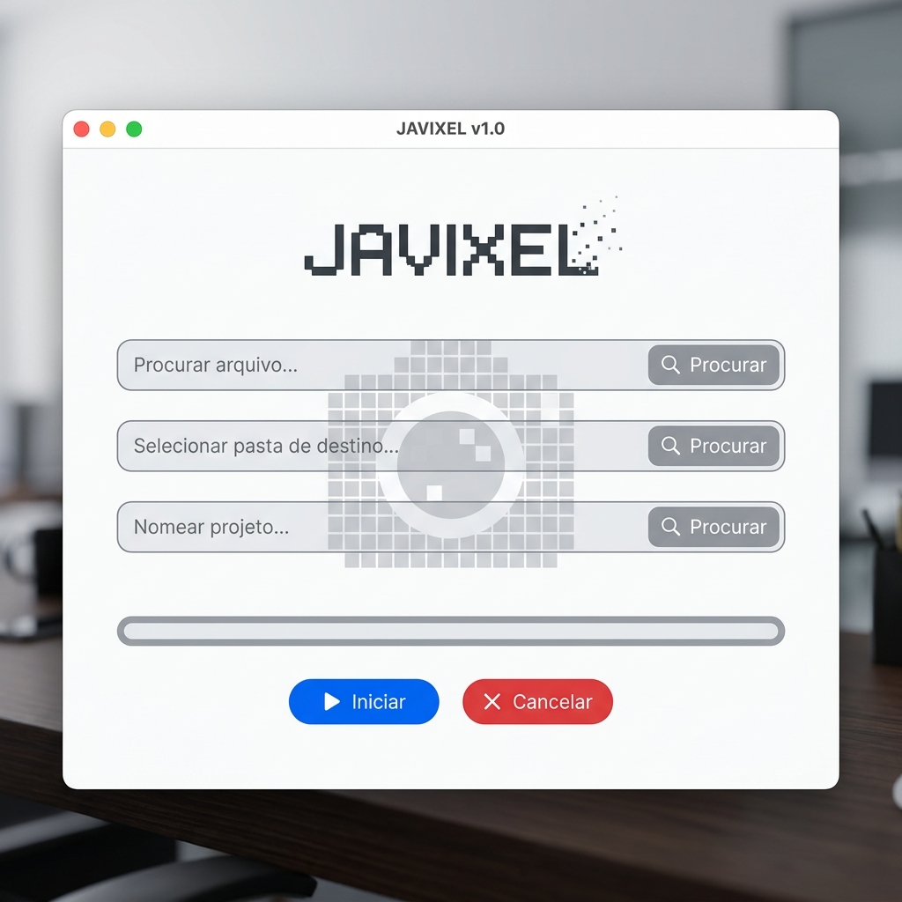

# Javixel

**Javixel** é um aplicativo desktop leve e moderno (Windows) desenhado especificamente para redimensionar em massa imagens JPEG e JPG. Com uma interface minimalista e amigável, o Javixel permite que você reduza o peso e a resolução de milhares de fotos simultaneamente com apenas alguns cliques, mantendo suas proporções originais!

Criado por: **Javan Oliveira de Almeida**

---

## 📸 Interface do Aplicativo

---

## 🚀 Como Usar

Usar o Javixel é um processo simples de três passos:

1. **Selecione as Imagens Originais:** Clique no primeiro botão `Procurar` (ou "Selecionar Pasta de Imagens") para escolher a pasta onde as suas fotos originais estão salvas.
2. **Escolha o Destino:** Clique no segundo botão `Procurar` (ou "Selecionar Pasta de Destino") para definir em qual pasta o Javixel deve salvar as novas versões mais leves das suas fotos.
3. **Defina o Tamanho (Opcional):** No terceiro campo, você pode especificar o tamanho máximo desejado em pixels. O aplicativo redimensionará o lado maior da foto para este limite, mantendo a proporção correta para não esticar a imagem.

Feito isso, basta clicar em **`▶ Iniciar`**.
Você poderá acompanhar o progresso pela barra de carregamento inferior. Caso precise interromper o processo, clique no botão vermelho **`✕ Cancelar`**.

---

## 📥 Como Baixar

Você não precisa instalar nenhum programa complexo no seu computador! 

1. Acesse a pasta `dist` deste repositório.
2. Baixe o arquivo **`Javixel.exe`**.
3. Dê um duplo clique no arquivo baixado para abri-lo e começar a usar! *(Como é um arquivo independente recém-criado, o Windows SmartScreen pode alertá-lo; basta clicar em "Mais informações" e em "Executar assim mesmo")*.

---

## 🛠️ Tecnologias Utilizadas

- **Linguagem:** Python 3
- **Interface Gráfica (GUI):** Tkinter
- **Processamento de Imagem:** Pillow (PIL)
- **Empacotador:** PyInstaller
